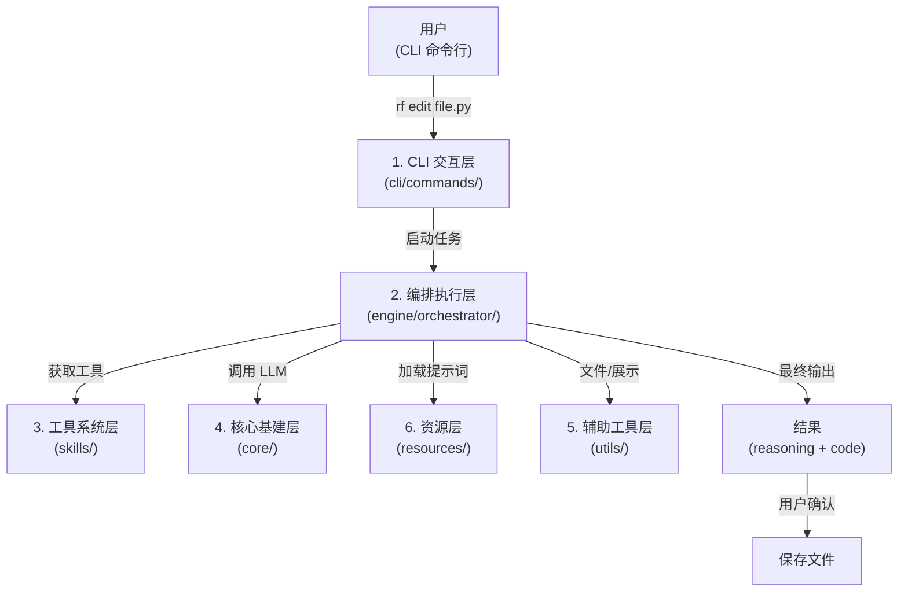
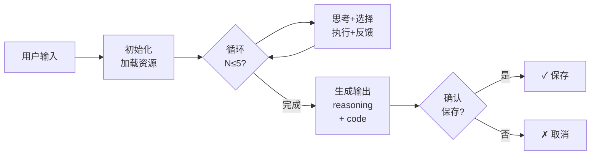

# Refrain 项目架构图

## 六层架构设计

```mermaid
graph TD
    User["用户<br/>(CLI 命令行)"]
    
    User -->|"rf edit file.py"| CLI["1. CLI 交互层<br/>(cli/commands/)"]
    
    CLI -->|"启动任务"| Engine["2. 编排执行层<br/>(engine/orchestrator/)"]
    
    Engine -->|"获取工具"| Skills["3. 工具系统层<br/>(skills/)"]
    Engine -->|"调用 LLM"| Core["4. 核心基建层<br/>(core/)"]
    Engine -->|"加载提示词"| Resources["6. 资源层<br/>(resources/)"]
    Engine -->|"文件/展示"| Utils["5. 辅助工具层<br/>(utils/)"]
    
    Engine -->|"最终输出"| Result["结果<br/>(reasoning + code)"]
    Result -->|"用户确认"| Save["保存文件"]
```

---

## ReAct 多轮流转

```mermaid
graph LR
    Start["用户输入"] 
    --> Init["初始化<br/>加载资源"]
    --> Loop{"循环<br/>N≤5?"}
    --> Process["思考+选择<br/>执行+反馈"]
    --> Loop
    Loop -->|完成| Output["生成输出<br/>reasoning<br/>+ code"]
    --> Diff{"确认<br/>保存?"}
    Diff -->|是| Save["✓ 保存"]
    Diff -->|否| Cancel["✗ 取消"]
```

